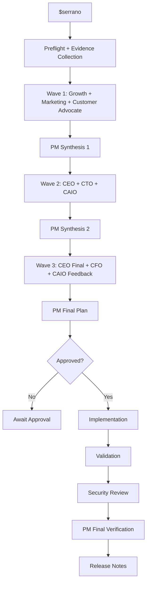

# Serrano

Serrano is Buffago's AI Product Manager orchestration system. It runs a staged Codex workflow that inspects the Buffago app, Supabase-related product data, Jalapeno marketing activity, available analytics, and evidence gaps, then produces one product recommendation package with an approval gate before any implementation work.

Serrano is exposed through one skill only:

```text
$serrano
```

## What Serrano Does

- collects sanitized product evidence from the repository and optional Supabase aggregates
- runs concurrent review waves through specialized internal Codex workers
- validates structured outputs and preserves Markdown and JSON artifacts
- resumes interrupted runs without rerunning unchanged successful workers
- produces a final implementation recommendation package
- blocks implementation until explicit approval is recorded
- can later run implementation, validation, security review, final verification, and release-note phases

## Architecture



## Layout

```text
Agents/Serrano/
  config/default.yaml
  prompts/
  serrano/
  tests/
  runs/
.agents/skills/serrano/
```

## Setup

Use Python 3.12.

```powershell
cd Agents/Serrano
python -m venv .venv
.venv\Scripts\activate
pip install -r requirements.txt
```

## Environment Variables

Required for repository-only discovery:

- none

Optional:

- `SUPABASE_URL`
- `SERRANO_SUPABASE_READ_KEY`
- `SUPABASE_SERVICE_ROLE_KEY`
- `SERRANO_ALLOW_SERVICE_ROLE_FALLBACK`
- `SERRANO_MAX_CONCURRENT_WORKERS`
- `SERRANO_DRY_RUN`
- `SERRANO_IMPLEMENTATION_ENABLED`
- `SERRANO_SECURITY_AUTOFIX_ENABLED`
- `SERRANO_MODEL`
- `SERRANO_REASONING_LEVEL`

## Safe Supabase Access

- Serrano prefers `SERRANO_SUPABASE_READ_KEY`.
- Service-role fallback is disabled by default.
- Discovery uses reviewed aggregate collectors only.
- Raw user rows, emails, tokens, and full free-text payloads are not passed to workers.
- If safe telemetry is missing, Serrano records evidence gaps instead of fabricating metrics.

## Commands

Default discovery:

```powershell
python .agents\skills\serrano\scripts\run_serrano.py
```

Status:

```powershell
python .agents\skills\serrano\scripts\run_serrano.py status
```

Resume:

```powershell
python .agents\skills\serrano\scripts\run_serrano.py resume <run-id>
```

Discover:

```powershell
python .agents\skills\serrano\scripts\run_serrano.py discover
```

Approve:

```powershell
python .agents\skills\serrano\scripts\run_serrano.py approve <run-id>
```

Build after approval:

```powershell
python .agents\skills\serrano\scripts\run_serrano.py build <run-id>
```

Security review:

```powershell
python .agents\skills\serrano\scripts\run_serrano.py security <run-id>
```

Release notes:

```powershell
python .agents\skills\serrano\scripts\run_serrano.py release <run-id>
```

Dry-run full workflow:

```powershell
$env:SERRANO_DRY_RUN="true"
python .agents\skills\serrano\scripts\run_serrano.py full
```

## Approval Workflow

- Discovery stops after the final product plan by default.
- Serrano writes `approval_required.md` and records the current plan hash.
- `approve <run-id>` stores timestamp, approved plan hash, approved scope, and approving action.
- If the final plan changes, approval is invalidated and must be renewed.

## Artifacts

Each run lives under `Agents/Serrano/runs/<run-id>/`.

Important outputs include:

- `evidence/evidence_manifest.json`
- `artifacts/final_product_plan.md`
- `artifacts/final_product_plan.json`
- `artifacts/approval_required.md`
- `artifacts/implementation_brief.md`
- `artifacts/measurement_plan.md`
- `artifacts/risk_register.md`
- `state/run_state.json`

Worker outputs are stored in:

- `workers/<worker-name>.json`
- `workers/<worker-name>.md`

## Resume Behavior

- successful workers are skipped when prompt and input hashes match
- failed workers are recorded without destroying the whole run
- resumptions continue from the last incomplete phase
- synthesis steps record failed reviewers as confidence reductions

## Cost Controls

- maximum concurrent workers is configurable
- worker timeout and retry count are configurable
- dry-run mode uses deterministic mock worker outputs and never writes app code
- implementation is disabled by default

## Troubleshooting

- If `codex` fails in PowerShell, Serrano defaults to `codex.cmd exec`.
- If Supabase credentials are absent, discovery still runs on repository evidence and records data gaps.
- If a run is interrupted, use `resume <run-id>`.
- If approval was recorded for an older plan hash, rerun `approve <run-id>`.

## Known Limitations

- repository-only discovery cannot infer live production metrics that are not instrumented
- Supabase aggregation relies on available read access and documented tables
- worker quality depends on the local Codex CLI configuration when dry-run mode is disabled

